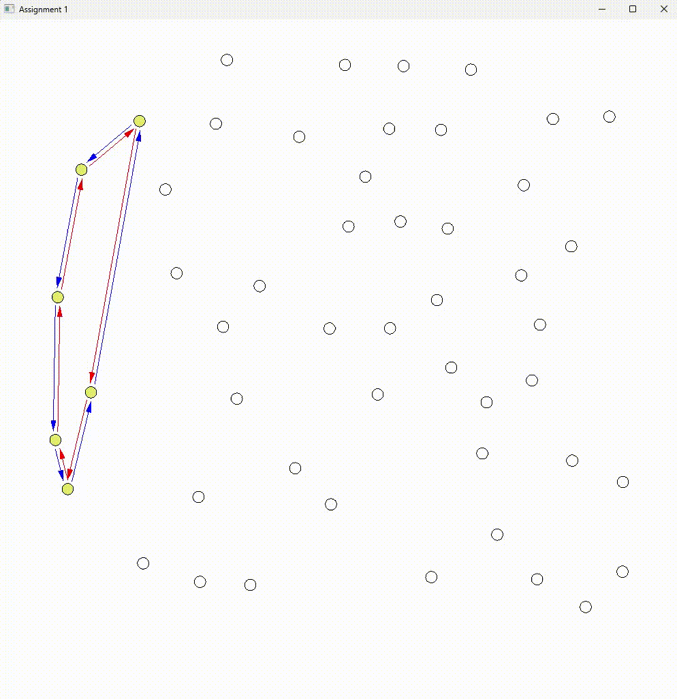

[Divide and Conquer](#divide-and-conquer) · [Dynamic Programming](#dynamic-programming) · [Greedy Algorithm](#greedy-algorithm)

# AlgorithmShowcase-main

**Mingwei Zou | Mathematical modeling · Algorithm design · Visual explanation**

A visual portfolio of three fundamental algorithmic paradigms. Each showcase connects a problem formulation to its implementation through a demonstration video, a technical explanation, and an evaluation of the results.

The portfolio focuses on translating mathematical ideas into computational procedures and assessing their correctness, efficiency, and limitations.

---

## Divide and Conquer

<!-- DIVIDE-AND-CONQUER:CONTENT:START -->

**2D Convex Hull | Computational Geometry · Recursive Decomposition · Geometric Predicates**

This project constructs the convex hull of a planar point set through recursive decomposition and geometric merging. It connects a mathematical description of an enclosing boundary with orientation tests, linked data structures, and a visual account of how smaller solutions combine into a larger one.

The technical focus is translating geometric reasoning into an executable algorithm whose intermediate states and final output can be inspected.

### Algorithm Visualization

<p align="center">
  
</p>

<!-- Replace the placeholder with the actual recording URL. -->

The viewer pauses before and after recursive merges, making it possible to examine the two component hulls and their combined boundary. Press **P** in the graphics window to advance through the paused stages.

| Visual element | Meaning in the implementation |
| --- | --- |
| Outlined circles | Input points |
| Yellow highlighting | Points in the current recursive subproblem, or points selected for inspection |
| Blue arrows | Links stored in `ccwPoint` |
| Red arrows | Links stored in `cwPoint` |

The arrows expose the underlying data structure: a hull is represented by neighboring-point links in both directions. Intermediate links can remain visible on points excluded from the final hull, as described under implementation limitations below.

### Problem and objective

Given a finite set of points in two dimensions, the **convex hull** is the smallest convex set containing them. For a non-collinear input, its boundary is a polygon whose vertices are drawn from the input points; the two-point case reduces to a line segment.

The computational task is to identify these boundary vertices and connect them in order. Interior points remain part of the original dataset but do not belong to the final boundary.

The recursive strategy uses the identity:

```text
conv(P_L ∪ P_R) = conv(conv(P_L) ∪ conv(P_R))
```

This means that the two subproblem hulls contain enough information to construct the combined hull. Points strictly inside either subproblem hull cannot become new extreme vertices of the union.

### Algorithm and implementation

The implementation in [`main.py`](Divide%20and%20Conquer/main.py) follows three stages:

1. **Divide.** Sort points by increasing `x`, using `y` to break ties. Split the ordered list into two approximately equal halves.
2. **Conquer.** Recursively construct each half's hull. Two-point and non-collinear three-point cases are handled directly by assigning clockwise and counterclockwise links.
3. **Combine.** Start at the rightmost point of the left hull and the leftmost point of the right hull. Walk along their boundaries using orientation tests to locate the two connecting tangents, reconnect the surviving boundary chains, and traverse the merged hull.

The geometric decision is based on the signed determinant:

```text
orient(a, b, c) = (a_x - c_x)(b_y - c_y) - (b_x - c_x)(a_y - c_y)
```

Its sign identifies a left turn, a right turn, or collinearity in the coordinate system. The `turn()` function supplies this predicate to the base cases and tangent searches.

| Component | Role |
| --- | --- |
| `buildHull()` | Handle base cases, divide the point list, and combine recursive results |
| `turn()` | Convert geometric orientation into a numerical decision |
| `merge()` | Search for connecting tangents and splice the hull boundaries |
| `cwPoint` / `ccwPoint` | Store each boundary point's two neighbors |
| `display()` | Expose intermediate structures before and after merges |

A useful correctness argument follows the same recursive structure: establish the small base cases, assume that the two subproblem hulls are correct, and show that the tangent connections preserve the outer boundary of their union. The visualization supports inspection of these steps; validation of the implementation provides a separate empirical check.

### Results and validation

The uploaded implementation was evaluated on the repository's five supplied point files. The original geometry functions were executed with rendering disabled, and their returned hull vertex sets were compared with an independently implemented monotone-chain reference algorithm.

| Input | Input points | Returned hull vertices | Vertex-set comparison | Reciprocal hull links |
| --- | ---: | ---: | --- | --- |
| `points1.txt` | 2 | 2 | Matched | Passed |
| `points2.txt` | 3 | 3 | Matched | Passed |
| `points3.txt` | 10 | 7 | Matched | Passed |
| `points4.txt` | 66 | 12 | Matched | Passed |
| `points5.txt` | 50 | 14 | Matched | Passed |

The same comparisons passed with `discardPoints` both disabled and enabled. Reciprocal-link checks confirmed that following a final hull vertex's clockwise link and then its counterclockwise link returns to that vertex, and vice versa.

These results support the returned boundary vertices and link consistency on the supplied inputs. They are not a claim of correctness for every possible point configuration, nor a runtime benchmark.

### Complexity and limitations

For balanced division and linear-time tangent merging on valid, non-degenerate hulls, the geometric computation follows:

```text
T(n) = T(⌊n/2⌋) + T(⌈n/2⌉) + O(n) = O(n log n)
```

Initial sorting also costs `O(n log n)`. Point records, temporary lists, and hull representations use `O(n)` peak storage under this model, with `O(log n)` recursive depth.

**Visualization has a separate cost.** Each call to `display()` redraws every input point. Across the recursion, this can contribute `O(n²)` drawing work, before additional refreshes and user-controlled pauses. The geometric bound therefore should not be interpreted as the elapsed complexity of the interactive demonstration.

<details>
<summary>Current implementation boundaries</summary>

- The code has no explicit zero-point or one-point base case, and its three-point case does not construct links for collinear points. Duplicate points and other degenerate configurations need additional handling.
- Orientation uses floating-point arithmetic and an exact zero comparison, so nearly collinear configurations require more robust numerical treatment.
- The optional `-d` mode attempts to remove obsolete links during merging. Checks on `points3.txt`, `points4.txt`, and `points5.txt` found that some excluded points still retain a link, even though the returned hull vertex sets and reciprocal links pass the checks above. Complete cleanup would require clearing both pointers of every excluded point while preserving the final boundary.

</details>

These distinctions make the project useful for studying the relationship between a mathematical algorithm, its representation in code, and the additional work needed for reliable numerical and visual behavior.

### Run the demonstration

Requires Python 3, PyOpenGL, GLFW, and a desktop environment that supports an OpenGL window. From the repository root:

```bash
python -m pip install PyOpenGL glfw
python "Divide and Conquer/main.py" "Divide and Conquer/points3.txt"
```

Use `points1.txt` and `points2.txt` to inspect the base cases, or `points4.txt` and `points5.txt` for larger recursive examples. Input files contain one `x y` coordinate pair per line.

| Control or option | Behavior |
| --- | --- |
| `P` in the graphics window | Advance past the current pause |
| Click a point | Print its coordinates and toggle its highlight |
| `Esc` | Exit |
| `-np` before the input filename | Disable instructional pauses |
| `-d` before the input filename | Enable the existing link-discarding logic, subject to the limitation above |

*Project context:* Based on [CMPE/CISC 365 Assignment 1](Divide%20and%20Conquer/A1.txt), using its supplied visualization framework. The algorithmic work centers on convex-hull base cases, recursive construction, and merging through geometric predicates and pointer updates.

<!-- DIVIDE-AND-CONQUER:CONTENT:END -->

[Back to overview](#algorithmshowcase-main)

---


## Dynamic Programming

<!-- DYNAMIC-PROGRAMMING:CONTENT:START -->

### Demonstration video

> [Video placeholder]

<!-- Replace the video placeholder with the actual recording URL. -->

### Problem and objective

> [Placeholder: the problem, inputs, desired output, and constraints.]

### Algorithm and implementation

> [Placeholder: the core idea, mathematical formulation, decision rules, and implementation.]

### Results and validation

> [Placeholder: the demonstrated output, measured results, and correctness checks.]

### Complexity and limitations

> [Placeholder: time and space complexity, assumptions, and trade-offs.]

### Run the demonstration

> [Placeholder: source files, dependencies, input data, and run commands.]

<!-- DYNAMIC-PROGRAMMING:CONTENT:END -->

[Back to overview](#algorithmshowcase-main)

---

## Greedy Algorithm

<!-- GREEDY-ALGORITHM:CONTENT:START -->

**Triangle Stripification | Computational Geometry · Graph Modeling · Discrete Optimization**

This project explores how local algorithmic decisions shape a global geometric solution. It converts a triangle mesh into edge-adjacent strips, connecting a mathematical optimization objective with explicit data structures, an executable heuristic, and checks on the resulting solution.

The work forms part of my broader interest in translating mathematical formulations into reliable computational methods.

### Algorithm Visualization

<p align="center">
  
</p>

<!-- Paste the actual recording URL on its own line, replacing the placeholder above. -->

**Example output: 200 vertices · 384 triangles · 15 triangle strips**

In the original mesh viewer, black edges outline the triangles, colored regions indicate strip membership, and white segments connect the centers of consecutive triangles. Following these segments reveals how local connections combine into paths across the mesh. Colors are visual aids and may look similar across different strips.

### Problem and objective

A triangle mesh represents a surface through triangular faces. In this project's formulation, a **triangle strip** is a sequence of distinct triangles in which consecutive triangles share an edge.

The objective is to partition the mesh into as few strips as possible while ensuring that:

- Every triangle is included exactly once.
- Each consecutive pair of triangles shares an edge.
- Each strip forms a path without repeated triangles or cycles.

The geometric problem can be expressed as a graph problem: triangles become nodes, and shared edges define adjacency. The task is then to find a vertex-disjoint path cover with a small number of paths. This representation makes both the optimization objective and the feasibility constraints explicit.

### Algorithm and implementation

The greedy heuristic prioritizes triangles with fewer available connection options. The intuition is that these constrained triangles may become harder to incorporate if their neighbors are assigned elsewhere first.

The implementation applies this principle in two stages:

1. **Order the starting triangles.** Sort triangles once by their initial available-neighbor count, then consider eligible strip starts in that fixed order.
2. **Extend each strip.** From the current endpoint, choose an available adjacent triangle that itself has the fewest available neighbors. Connect it to the strip and continue until no extension is possible.

For endpoint `c`, the extension rule is:

$$
t^* = \arg\min_{t \in N_{\mathrm{avail}}(c)} |N_{\mathrm{avail}}(t)|.
$$

Here, `N_avail` denotes neighbors eligible under the implementation's pointer-based checks. Candidate scores are evaluated as the strip grows; the initial seed order is not recomputed between strips. Ties follow the existing list order.

| Implementation component | Purpose |
| --- | --- |
| Shared-edge lookup | Match sorted vertex-index pairs to construct mesh adjacency |
| `adjTris` | Store the neighboring triangles used in local decisions |
| `nextTri` and `prevTri` | Represent each strip as a doubly linked sequence |
| Strip colors and center-to-center links | Make the computed structure visually inspectable |

The core logic is implemented in [`buildTristrips()`](Greedy%20Algorithm/tristrips.py). Each extension commits to one local choice, without backtracking or enumerating complete strip arrangements.

### Results and validation

The supplied desktop run confirms that `data/200` contains **200 vertices and 384 triangles**, producing **15 strips**. Core-function checks on all three repository datasets yielded:

| Dataset | Vertices | Triangles | Generated strips | Structural validation |
| --- | ---: | ---: | ---: | --- |
| `data/200` | 200 | 384 | 15 | Passed |
| `data/1000` | 1,000 | 1,978 | 82 | Passed |
| `data/10000` | 10,000 | 19,969 | 872 | Passed |

Validation traversed every resulting strip and checked complete coverage, absence of repeated triangles and cycles, adjacency of consecutive triangles, and reciprocal forward/backward pointers. Reconstructed strip counts agreed with the routine's printed output.

These checks establish feasible solutions on the supplied inputs. They distinguish structural correctness from the separate question of how close the strip count is to the global minimum.

<details>
<summary>Evaluation scope</summary>

The results above come from executing the original mesh reader and greedy routine without the OpenGL interface. The checked source and datasets match repository commit `c76e0428b691596d6d511e439e88c90fab6676d1`.

The course's [`results.txt`](Greedy%20Algorithm/results.txt) contains reference figures, including different strip counts on the larger inputs. Its baseline reduction and machine-specific timings are not measurements of this implementation. No runtime or rendering-speed improvement is claimed here.

</details>

### Complexity and limitations

For a valid manifold triangle mesh, each triangle has at most three edge-neighbors. With `n` triangles and `v` vertices:

- Reading the mesh and constructing adjacency takes expected `O(v + n)` time using shared-edge hashing.
- Sorting the initial starting order takes `O(n log n)` time.
- Strip extension takes `O(n)` time because each local candidate search has bounded size.

The resulting bound is **expected `O(v + n log n)` time and `O(v + n)` memory**, excluding visualization.

The heuristic produces a feasible path cover but does not guarantee the minimum number of strips. Initial ordering and tie-breaking can affect solution quality. A natural extension would compare fixed seed ordering with dynamically updated priorities or limited look-ahead, measuring improvements in strip count against additional computational cost.

This distinction between objective, heuristic, and verified outcome is central to the project's technical value: translating a mathematical problem into code while evaluating what the implementation actually establishes.

### Run the demonstration

Requires Python 3, PyOpenGL, GLFW, and a desktop environment that supports an OpenGL window. From the repository root:

```bash
python -m pip install PyOpenGL glfw
python "Greedy Algorithm/tristrips.py" "Greedy Algorithm/data/200"
```

Replace the final dataset path with `Greedy Algorithm/data/1000` or `Greedy Algorithm/data/10000` to inspect larger inputs. If the local directory is named `Greedy-Algorithm`, use that spelling in both paths.

*Project context:* Based on [CMPE/CISC 365 Assignment 2](Greedy%20Algorithm/A2.txt), using its supplied visualization framework. The algorithmic focus is the greedy strip-building routine and the interpretation of its results.

<!-- GREEDY-ALGORITHM:CONTENT:END -->

[Back to overview](#algorithmshowcase-main)
