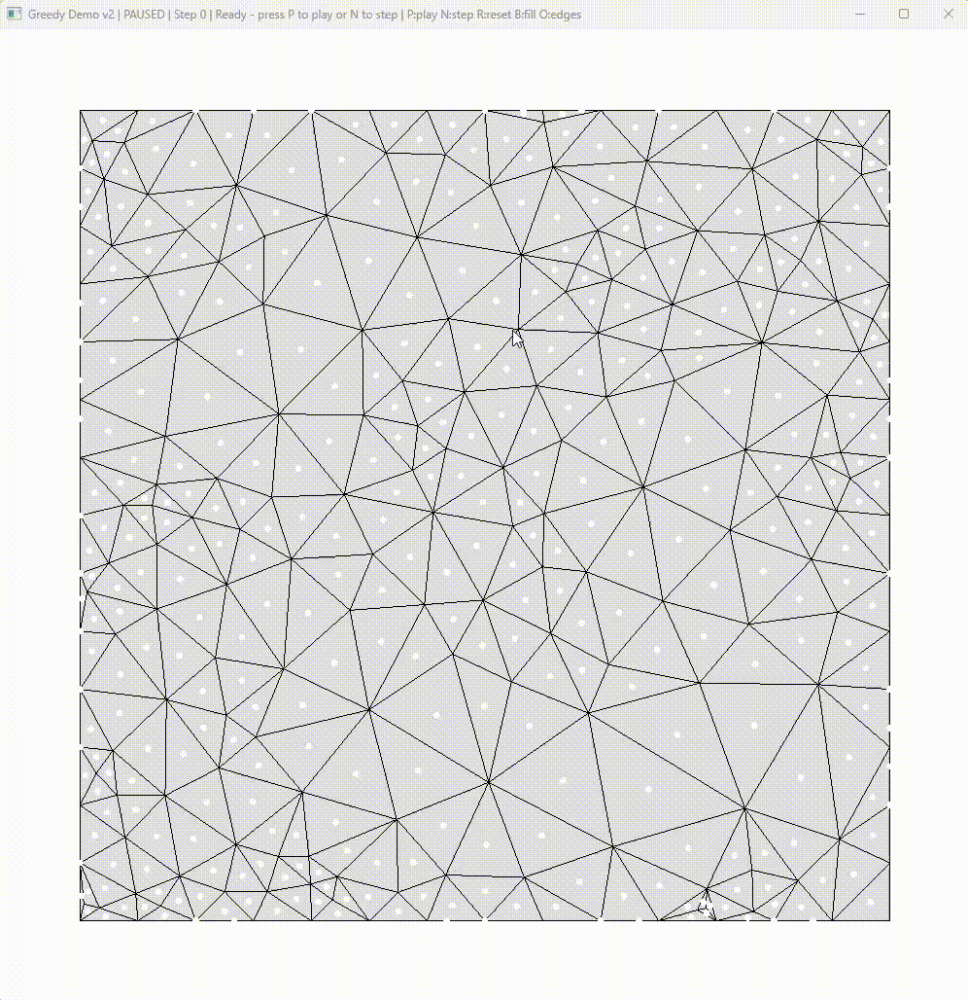

[Divide and Conquer](#divide-and-conquer) · [Dynamic Programming](#dynamic-programming) · [Greedy Algorithm](#greedy-algorithm)

# AlgorithmShowcase-main

**Mingwei Zou | Mathematical modeling · Algorithm design · Visual explanation**

A visual portfolio of three fundamental algorithmic paradigms. Each showcase connects a problem formulation to its implementation through a demonstration video, a technical explanation, and an evaluation of the results.

The portfolio focuses on translating mathematical ideas into computational procedures and assessing their correctness, efficiency, and limitations.

---

## Divide and Conquer

<!-- DIVIDE-AND-CONQUER:CONTENT:START -->

### Demonstration video

> [Video placeholder]

<!-- Replace the video placeholder with the actual recording URL. -->

### Problem and objective

> [Placeholder: the problem, inputs, desired output, and constraints.]

### Algorithm and implementation

> [Placeholder: the core idea, mathematical formulation, decision rules, and implementation.]

### Results and validation

> [Placeholder: the demonstrated output, measured results, and correctness checks.]

### Complexity and limitations

> [Placeholder: time and space complexity, assumptions, and trade-offs.]

### Run the demonstration

> [Placeholder: source files, dependencies, input data, and run commands.]

<!-- DIVIDE-AND-CONQUER:CONTENT:END -->

[Back to overview](#algorithmshowcase-main)

---

## Dynamic Programming

<!-- DYNAMIC-PROGRAMMING:CONTENT:START -->

### Demonstration video

> [Video placeholder]

<!-- Replace the video placeholder with the actual recording URL. -->

### Problem and objective

> [Placeholder: the problem, inputs, desired output, and constraints.]

### Algorithm and implementation

> [Placeholder: the core idea, mathematical formulation, decision rules, and implementation.]

### Results and validation

> [Placeholder: the demonstrated output, measured results, and correctness checks.]

### Complexity and limitations

> [Placeholder: time and space complexity, assumptions, and trade-offs.]

### Run the demonstration

> [Placeholder: source files, dependencies, input data, and run commands.]

<!-- DYNAMIC-PROGRAMMING:CONTENT:END -->

[Back to overview](#algorithmshowcase-main)

---

## Greedy Algorithm

<!-- GREEDY-ALGORITHM:CONTENT:START -->

**Triangle Stripification | Computational Geometry · Graph Modeling · Discrete Optimization**

This project explores how local algorithmic decisions shape a global geometric solution. It converts a triangle mesh into edge-adjacent strips, connecting a mathematical optimization objective with explicit data structures, an executable heuristic, and checks on the resulting solution.

The work forms part of my broader interest in translating mathematical formulations into reliable computational methods.

### Algorithm Visualization

<p align="center">
  
</p>

<!-- Paste the actual recording URL on its own line, replacing the placeholder above. -->

**Example output: 200 vertices · 384 triangles · 15 triangle strips**

In the original mesh viewer, black edges outline the triangles, colored regions indicate strip membership, and white segments connect the centers of consecutive triangles. Following these segments reveals how local connections combine into paths across the mesh. Colors are visual aids and may look similar across different strips.

### Problem and objective

A triangle mesh represents a surface through triangular faces. In this project's formulation, a **triangle strip** is a sequence of distinct triangles in which consecutive triangles share an edge.

The objective is to partition the mesh into as few strips as possible while ensuring that:

- Every triangle is included exactly once.
- Each consecutive pair of triangles shares an edge.
- Each strip forms a path without repeated triangles or cycles.

The geometric problem can be expressed as a graph problem: triangles become nodes, and shared edges define adjacency. The task is then to find a vertex-disjoint path cover with a small number of paths. This representation makes both the optimization objective and the feasibility constraints explicit.

### Algorithm and implementation

The greedy heuristic prioritizes triangles with fewer available connection options. The intuition is that these constrained triangles may become harder to incorporate if their neighbors are assigned elsewhere first.

The implementation applies this principle in two stages:

1. **Order the starting triangles.** Sort triangles once by their initial available-neighbor count, then consider eligible strip starts in that fixed order.
2. **Extend each strip.** From the current endpoint, choose an available adjacent triangle that itself has the fewest available neighbors. Connect it to the strip and continue until no extension is possible.

For endpoint `c`, the extension rule is:

$$
t^* = \arg\min_{t \in N_{\mathrm{avail}}(c)} |N_{\mathrm{avail}}(t)|.
$$

Here, `N_avail` denotes neighbors eligible under the implementation's pointer-based checks. Candidate scores are evaluated as the strip grows; the initial seed order is not recomputed between strips. Ties follow the existing list order.

| Implementation component | Purpose |
| --- | --- |
| Shared-edge lookup | Match sorted vertex-index pairs to construct mesh adjacency |
| `adjTris` | Store the neighboring triangles used in local decisions |
| `nextTri` and `prevTri` | Represent each strip as a doubly linked sequence |
| Strip colors and center-to-center links | Make the computed structure visually inspectable |

The core logic is implemented in [`buildTristrips()`](Greedy%20Algorithm/tristrips.py). Each extension commits to one local choice, without backtracking or enumerating complete strip arrangements.

### Results and validation

The supplied desktop run confirms that `data/200` contains **200 vertices and 384 triangles**, producing **15 strips**. Core-function checks on all three repository datasets yielded:

| Dataset | Vertices | Triangles | Generated strips | Structural validation |
| --- | ---: | ---: | ---: | --- |
| `data/200` | 200 | 384 | 15 | Passed |
| `data/1000` | 1,000 | 1,978 | 82 | Passed |
| `data/10000` | 10,000 | 19,969 | 872 | Passed |

Validation traversed every resulting strip and checked complete coverage, absence of repeated triangles and cycles, adjacency of consecutive triangles, and reciprocal forward/backward pointers. Reconstructed strip counts agreed with the routine's printed output.

These checks establish feasible solutions on the supplied inputs. They distinguish structural correctness from the separate question of how close the strip count is to the global minimum.

<details>
<summary>Evaluation scope</summary>

The results above come from executing the original mesh reader and greedy routine without the OpenGL interface. The checked source and datasets match repository commit `c76e0428b691596d6d511e439e88c90fab6676d1`.

The course's [`results.txt`](Greedy%20Algorithm/results.txt) contains reference figures, including different strip counts on the larger inputs. Its baseline reduction and machine-specific timings are not measurements of this implementation. No runtime or rendering-speed improvement is claimed here.

</details>

### Complexity and limitations

For a valid manifold triangle mesh, each triangle has at most three edge-neighbors. With `n` triangles and `v` vertices:

- Reading the mesh and constructing adjacency takes expected `O(v + n)` time using shared-edge hashing.
- Sorting the initial starting order takes `O(n log n)` time.
- Strip extension takes `O(n)` time because each local candidate search has bounded size.

The resulting bound is **expected `O(v + n log n)` time and `O(v + n)` memory**, excluding visualization.

The heuristic produces a feasible path cover but does not guarantee the minimum number of strips. Initial ordering and tie-breaking can affect solution quality. A natural extension would compare fixed seed ordering with dynamically updated priorities or limited look-ahead, measuring improvements in strip count against additional computational cost.

This distinction between objective, heuristic, and verified outcome is central to the project's technical value: translating a mathematical problem into code while evaluating what the implementation actually establishes.

### Run the demonstration

Requires Python 3, PyOpenGL, GLFW, and a desktop environment that supports an OpenGL window. From the repository root:

```bash
python -m pip install PyOpenGL glfw
python "Greedy Algorithm/tristrips.py" "Greedy Algorithm/data/200"
```

Replace the final dataset path with `Greedy Algorithm/data/1000` or `Greedy Algorithm/data/10000` to inspect larger inputs. If the local directory is named `Greedy-Algorithm`, use that spelling in both paths.

*Project context:* Based on [CMPE/CISC 365 Assignment 2](Greedy%20Algorithm/A2.txt), using its supplied visualization framework. The algorithmic focus is the greedy strip-building routine and the interpretation of its results.

<!-- GREEDY-ALGORITHM:CONTENT:END -->

[Back to overview](#algorithmshowcase-main)
